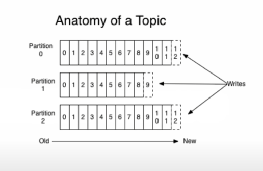
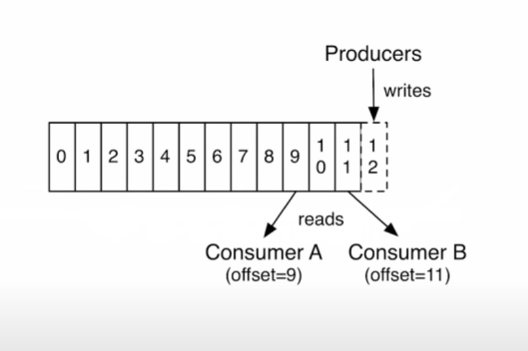
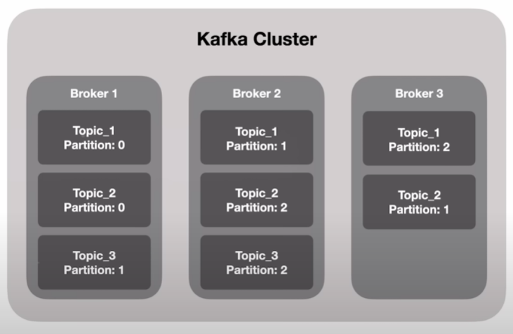
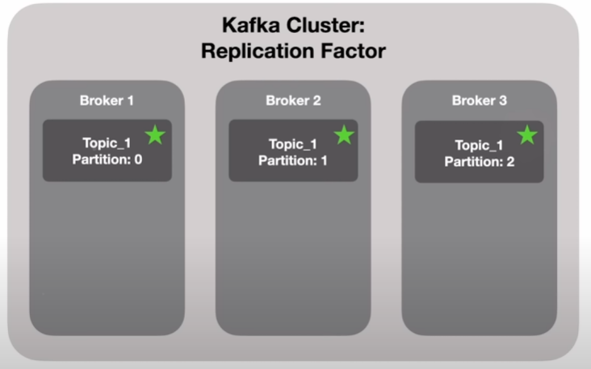
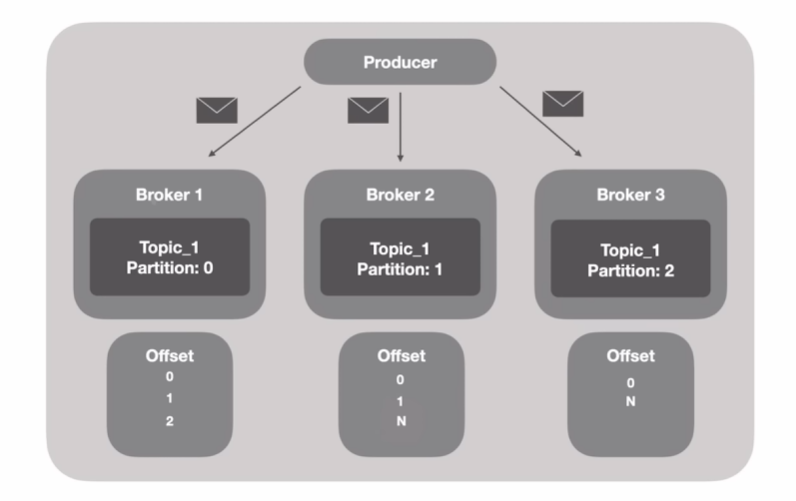
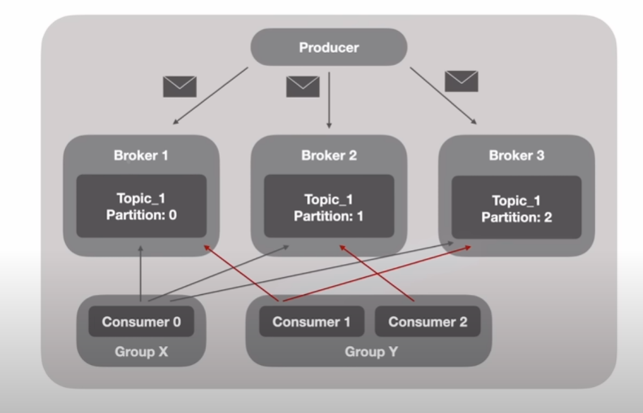

# Apache kafka
- Event-driven
  - Carros
  - E-commerce
  - Alermes
  - Monitoramento
  - Microsserviços
- Tempo real
- Historico dos dados 
- Caracteristicas:
    - Plataforma
    - Trabalha de forma distribuida
    - Banco de dados
    - Extremamente rápido e com baixa latência
    - Kafka não é apenas filas como RabbitMQ
    - Utiliza o disco ao invés de memória para processar os dados  
- Topic
    - Stream de dados que atua como um banco de dados
    - Todos os dados ficam armazenados, cada Topic tem seu "local" para armazenar seus dados
    - O topico possui diversas partições
      - Partições definidas por número
      - Obrigado á definir quantidade de partições quando for criar um Topic

    - Cada partição é definida por um número
    - Voce é obrigado a definir a quantidade de partições de um tópico

- Producers: mandam mensagens
- Consumer: lêem mensagens

# Kafka Cluster
- Conjunto de Brokers
- Cada Broker é um server
- Cada Broker é responsável por armazenar os dados de uma partição
- Cada partição de Topic está distribuido em diferentes brokers

- Com replication factor o Kafka faz diversas copias de particoes de um Topic em diferentes brokes fazendo com que mesmo que uma maquina esteja fora do ar ele tenha a informacao completa.

# Ecossistema
- Kafka Connect
    - Connectors
- Confluent Schema Registry
- Rest Proxy
- ksqlDB
- Streams
