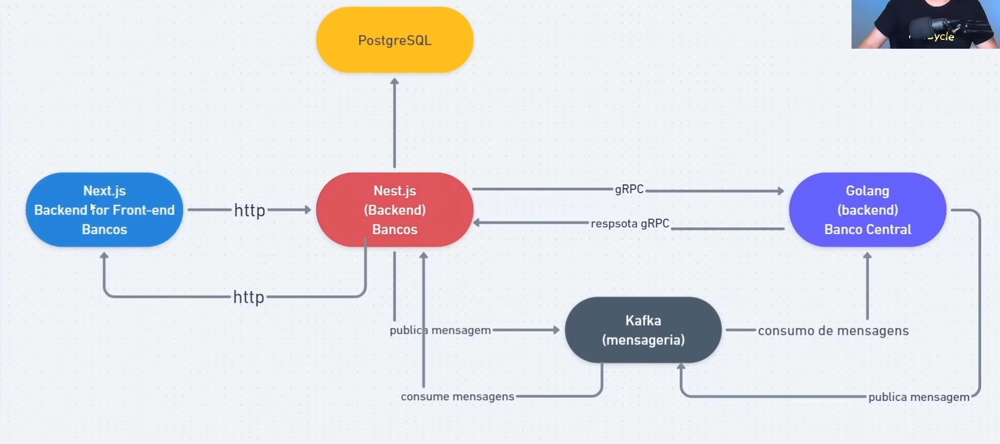
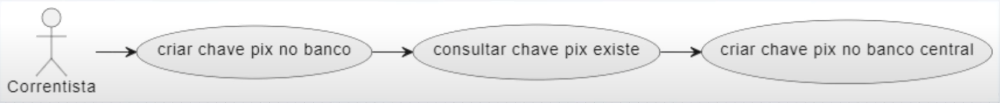

## Arquitetura geral do sistema

- Teremos o Next com BFF dos bancos, o correntista faz manipulações que resultam em chamada http
- Irá para o Nest.js que salvará em um Banco de dados PostgreSQL
- Quando criarmos e consultamos chaves PIX, faremos via gRPC ao microsserviço Golang(Banco Central)
- E quando um correntista quiser fazer uma transação, usaremos o Kafka

## Casos de uso

## 1 - Criar chaves pix

### Caso de uso

### Fluxo das operações

## 2 - Consultar minhas chaves pix

### Caso de uso

#### Fluxo das operações

## 3 - Criar transferência

### Caso de uso

### Fluxo das operações - Iniciar transferência

### Fluxo das operações - Notificar transferência para outro banco (alvo)

### Fluxo das operações - Notificar transferência para banco origem

## 4 - Listar minhas transações

### Caso de uso

### Fluxo de operações

